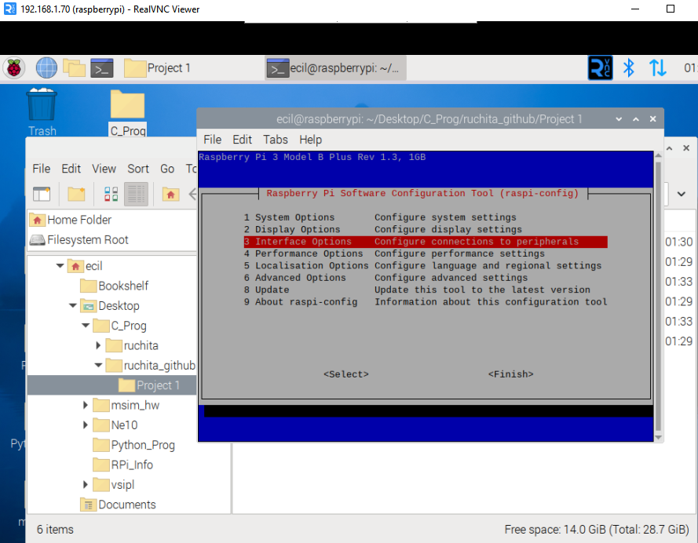

## Connections

| Raspberry Pi | ESP8266 |
|-------------|---------|
| GPIO2 (SDA) | D2 |
| GPIO3 (SCL) | D1 |
| GND | GND |

---

## Steps
1. Enable I2C on the Raspberry Pi using `raspi-config`.


## determine i2c 


## enable i2c


3. Connect the I2C lines as shown above.
4. Upload `esp_i2c_master.ino` to the ESP8266.
5. Compile and run the I2C slave program on the Raspberry Pi:
   ```bash
   gcc pi_i2c_slave.c -o i2c_slave
   ./i2c_slave
