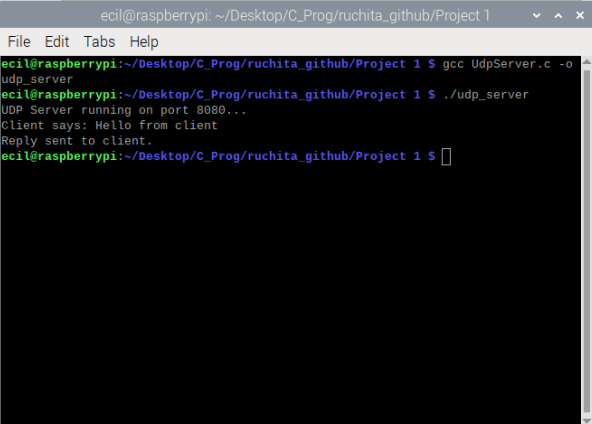

## UDP Communication – Setup & Execution

### Steps
1. Connect the Raspberry Pi and ESP8266 to the same Wi-Fi network.
2. Note the IP address of the Raspberry Pi.
3. Compile the UDP server and client programs on the Raspberry Pi:
   ```bash
   gcc UdpServer.c -o udp_server
   gcc UdpClient.c -o udp_client
4. Output should look like :
   ## Upon initialization of server:

   ## Upon initialization of client:


 
